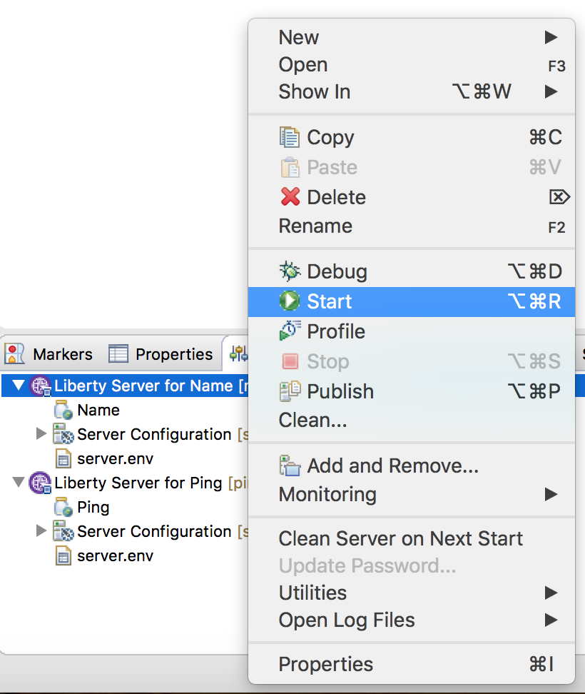

# LAB - Checking the health of microservices on Kubernetes

Learn how to check the health of microservices on Kubernetes by setting up readiness probes to inspect MicroProfile Health Check endpoints.

## What you’ll learn

You will learn how to create a health check endpoint for your microservices. Then, you will configure Kubernetes to use this endpoint to keep your microservices running smoothly.

MicroProfile Health allows services to report their health, and it publishes the overall health status to a defined endpoint. A service reports `UP` if it is available and reports `DOWN` if it is unavailable. MicroProfile Health reports an individual service status at the endpoint and indicates the overall status as `UP` if all the services are `UP`. A service orchestrator can then use the health statuses to make decisions.

Kubernetes provides liveness and readiness probes that are used to check the health of your containers, you will work with readiness probes. These probes can check certain files in your containers, check a TCP socket, or make HTTP requests. MicroProfile Health exposes a health endpoint on your microservices. Kubernetes polls the endpoint as specified by the probes to react appropriately to any change in the microservice’s status. 

## Prerequisites

**You must be connected to the internet to perform this tasks**

- **MacOS, Linux on x86_64 architecture only**
    - If you are running on Windows, please prepare virtual box/machine with Ubuntu
    - Ubuntu: https://www.ubuntu.com/download/desktop
    - Virtual Box: https://www.virtualbox.org/wiki/Downloads
- **Git client**
    - MacOS X: https://git-scm.com/download/mac
    - Linux/Unix: https://git-scm.com/download/linux
- **Curl**
    - Download and install curl: https://curl.haxx.se/download.html
- **Eclispe**
    - Download and install Eclipse IDE for Enterprise Java Developers: https://www.eclipse.org/downloads/packages/
- **OpenLiberty**
    - Download the latest version of OpenLiberty: https://openliberty.io/downloads/
- **Docker**
     - Version 17.06 minimum: https://docs.docker.com/install/ 
- **IBM Cloud Kubernetes Cluster**
    - Create K8s cluster in IBM Cloud (a free or standard cluster with 1 worker node in it).
    - Install CLI, create a private regristry, setup up created cluster envrironment.
    - You can use tutorial to do these steps: https://cloud.ibm.com/docs/containers?topic=containers-cs_cluster_tutorial#cs_cluster_tutorial


## Getting started 

The two microservices you will work with are called `Name` and `Ping`. The `Name` microservice displays a brief greeting and its application name. The `Ping` microservice pings the `Name` microservice. The `Ping`  demonstrates how communication can be established between microservices. 

The `Ping` microservice should only be healthy when `Name` is available. To add this check to the `/health` endpoint, you will create a class implementing the `HealthCheck` interface.

**TASK 1. Download projects**

Go to the directory where you want to clone repository from github.

````
$ cd /Users/albert/Projects/openliberty
````

You can use git to clone repository or download it directly from github: `https://github.com/albert-haliulov/microprofile-healthcheck`


````
$ git clone https://github.com/albert-haliulov/microprofile-healthcheck.git
````

**TASK 2. Open Eclipse IDE**


Change Eclipse workspace to directory where you unpacked `microprofile-healtcheck`


Find and Install IBM Liberty Developer Tools for building and deploying JEE apps to OpenLiberty:


- Open Eclipse Marketplace: Menu->Help->Eclipse Marketplace:


- Find Liberty package: Write `Liberty` in `Find` field and click `Go` button:


- Install Liberty Developer Tools 19.0.0.3 -> Select appropriate package from the list and click `Install` button:


- RESTART ECLIPSE

**TASK3. Create Liberty runtime**

In order to run our applications we need to setup server runtime environment. For this we need to install OpenLiberty and set it as a runtime environment in Eclipse workspace.

Open menu Eclipse->Preferences and type 'Runtime Environments' in search field:


Then click `Add..` button to create new runtime, select `Liberty` from the list and click `Next` button:


Check radio button `Install from an archive or a repoitory`, others keep unchanged and click `Next` button:


Enter the `destination path` where you want to install OpenLiberty, set the path to the previously donwloaded `openliberty-XXXXXX.zip` package and click `Finish` button:


As a result it has to show that openliberty successfully installed. Click `OK`:


You will see created `Liberty Runtime`, click `Apply and Close`.


**TASK4. Import projects into Eclipse workspace**

Use menu `File->Import`:


Select `General->Existing Projects into Workspace`:


Select directory with the `Name` project and click `Finish`:


**Repeat the same steps for `Ping` project.**

Finally we need to setup Facets in order to Eclipse IDE properly recognized our projects as Java Web projects. You should set the following options for both projects:


**TASK5. Deploy microservices.**

Create server for `Name` microservice `Click this link to create a new server`:


Set the name for the server `Liberty Server for Name`:


Set serer name to `name`, click `Finish`


Repeat the same steps to create server for `Ping` microservice.


Click `New` to create new server:


Set server name `ping` and `Finish`:


And again click `Finish`:


Now you are ready to deploy microservices into these servers:


Right click on `Liberty Server for Name` and select menu item `Add and Remove...`:


Select on the left side `Name` microservice and click `Add >` button. After `Finish` it will deploy `Name` microservice:


**Repeat the same steps for `Liberty Server for Ping` and `Ping` microservice.**

**TASK6. Configure Liberty servers.**

Explore the already prepared Liberty configuration for each of microservices -`server.xml`:
````
<server description="Liberty Server for Name microservice">
    
    <featureManager>
    	<feature>jaxrs-2.1</feature>
        <feature>cdi-2.0</feature>
    	<feature>mpHealth-1.0</feature>
        <feature>localConnector-1.0</feature>
    </featureManager>

    <httpEndpoint host="*" httpPort="9080" httpsPort="9443" id="defaultHttpEndpoint"/>

    <applicationManager autoExpand="true"/>

    <applicationMonitor updateTrigger="mbean"/>

    <webApplication contextRoot="api" id="Name" location="Name.war" name="Name"/>
</server>
````
````
<server description="Liberty Server for Ping microservice">
    
    <featureManager>
    	<feature>jaxrs-2.1</feature>
        <feature>cdi-2.0</feature>
    	<feature>mpRestClient-1.0</feature>
    	<feature>mpConfig-1.2</feature>
    	<feature>mpHealth-1.0</feature>
        <feature>localConnector-1.0</feature>
    </featureManager>

    <httpEndpoint host="*" httpPort="9081" httpsPort="9444" id="defaultHttpEndpoint"/>

    <applicationManager autoExpand="true"/>

    <applicationMonitor updateTrigger="mbean"/>

    <webApplication contextRoot="api" id="Ping" location="Ping.war" name="Ping"/>
</server>
````

We used `api` as a web `Context Root` for both microservices. `HTTP Listener` port `9080` and `HTTPS Listener` port `9443` for `Liberty Server for Name`. `9081` & `9444` for `Liberty Server for Ping`. To access these servers from a remote client added a host attribute `host="*"`. 

Update `server.xml` of both servers by the supplied files from the root of each application folder. 

Open Liberty configuration and update it: 


**Don't forget to change `server.xml` in second server.**

**TASK7. Invoke microservices.**

Start application servers `Liberty Server for Name` and `Liberty Server for Ping`:



Invoke `Name` microservice:
````
$ curl -X GET http://localhost:9080/api/name
Hello! I'm application NameService
````

The `Ping` microservice uses `<hostname>` parameter from the invocation URL `http://localhost:9081/api/ping/<hostname>` to call `Name` microservice by `http://<hostname>:9080/api/name`. If `Name` is available then `Ping` replies `pong`:
````
$ curl -X GET http://localhost:9081/api/ping/localhost
pong
````

## Adding a health check to the `Ping` microservice
 
The `Ping` microservice should only be healthy when `Name` is available. To add this check to the `/health` endpoint, let's create a class implementing the `HealthCheck` interface.

>Create class PingHealth.
`io/openliberty/guides/ping/PingHealth.java`
````
package io.openliberty.guides.ping;

import java.net.URL;

import javax.enterprise.context.ApplicationScoped;
import javax.inject.Inject;

import org.eclipse.microprofile.config.inject.ConfigProperty;
import org.eclipse.microprofile.health.Health;
import org.eclipse.microprofile.health.HealthCheck;
import org.eclipse.microprofile.health.HealthCheckResponse;
import org.eclipse.microprofile.health.HealthCheckResponseBuilder;
import org.eclipse.microprofile.rest.client.RestClientBuilder;

import io.openliberty.guides.ping.client.NameClient;
import io.openliberty.guides.ping.client.UnknownUrlException;

@Health
@ApplicationScoped
public class PingHealth implements HealthCheck {
	@Inject
    @ConfigProperty(name = "NAME_HOSTNAME", defaultValue="localhost")
    private String hostname;

    public HealthCheckResponse call() {
        HealthCheckResponseBuilder builder = HealthCheckResponse.named(hostname);
        if (isNameServiceReachable()) {
            builder = builder.up();
        } else {
            builder = builder.down();
        }

        return builder.build();
    }

    private boolean isNameServiceReachable() {
        try {
            NameClient client = RestClientBuilder
                .newBuilder()
                .baseUrl(new URL("http://" + hostname + ":9080/api"))
                .register(UnknownUrlException.class)
                .build(NameClient.class);

            client.getContainerName();
            return true;
        } catch (Exception ex) {
            return false;
        }
    }
}
````

## Play with microservices

This health check verifies that the `Name` microservice is available at `http://localhost:9081/api/name`. If it’s available, then it returns an `UP` status. Similarly, if it’s unavailable then it returns a `DOWN` status. When the status is `DOWN` the microservice is considered to be unhealthy.

The health check for the `Name` microservice has already been implemented. It has been setup to become unhealthy for 60 seconds when a specific endpoint is called - `http://localhost:9080/api/name/unhealthy`. This endpoint has been provided for you to observe the results of an unhealthy pod.


````
$ curl -X GET http://localhost:9080/api/name
Hello! I'm application NameService
````

````
$ curl -X GET http://localhost:9081/api/ping/localhost
pong
````

````
$ curl -X GET http://localhost:9080/health
{"checks":[{"data":{},"name":"isAlive","state":"UP"}],"outcome":"UP"}
````

````
curl -X POST http://localhost:9080/api/name/unhealthy
Application NameService is now unhealthy...
````

````
$ curl -X GET http://localhost:9080/api/name
ERROR: Service is currently in maintenance.
````

````
$ curl -X GET http://localhost:9080/health
{"checks":[{"data":{},"name":"isAlive","state":"DOWN"}],"outcome":"DOWN"}
````

````
$ curl -X GET http://localhost:9081/api/ping/localhost
ERROR: Service is currently in maintenance.
````

````
$ curl -X GET http://localhost:9081/health
{"checks":[{"data":{},"name":"localhost","state":"DOWN"}],"outcome":"DOWN"}
````
## Export microservices as WAR files

We need to export microservices in order to containerize them:


Save WAR file to the `bin` folder of each project. If `bin` doesn't exist then create it. Use `Name.war` for `Name` microservice, `Ping.war` for `Ping`. Check box `Overwrite existing file` if file with the same name exists.


## Build docker images

We supplied Dockerfiles for creating `Name` and `Ping` images. They are located in the application folders. Explore one of them:
````
FROM open-liberty

COPY --chown=1001:0 server.xml /config
COPY --chown=1001:0 *.war /config/apps/Name.war
````

Build `name:1.0` image:

````
$ cd Name/

$ docker build -t name:1.0 .
Sending build context to Docker daemon  162.8kB
Step 1/3 : FROM open-liberty
 ---> d447e301fe7c
Step 2/3 : COPY --chown=1001:0 server.xml /config
 ---> 07efaf2293b4
Step 3/3 : COPY --chown=1001:0 *.war /config/apps/name.war
 ---> 30e2bec82e9f
Successfully built 30e2bec82e9f
Successfully tagged name:1.0
````
Build `ping:1.0` image:

````
$ cd Ping/

$ docker build -t ping:1.0 .
Sending build context to Docker daemon  1.163MB
Step 1/3 : FROM open-liberty
 ---> d447e301fe7c
Step 2/3 : COPY --chown=1001:0 server.xml /config
 ---> 9277e6fab8b0
Step 3/3 : COPY --chown=1001:0 *.war /config/apps/ping.war
 ---> a9868d823b4b
Successfully built a9868d823b4b
Successfully tagged ping:1.0
````

Check for images have been created:

````
$ docker images
REPOSITORY                               TAG                 IMAGE ID            CREATED             SIZE
name                                     1.0                 7c3773c712a7        16 hours ago        535MB
ping                                     1.0                 fea53a6caf11        16 hours ago        535MB
````

Now we are ready for the next step - run containers.

## Run & Play with Docker containers

Run docker containers from prepared images with `Name` and `Ping` services. In order to start containes we will use `docker-compose`.

Docker Compose is a tool for defining and running multi-container Docker applications. It uses YAML files to configure the application's services and performs the creation and start-up process of all the containers with a single command.

Look at supplied `docker-compose.yaml`:

````
version: '3'

services:
   name-service:
     image: name:1.0
     ports:
       - 9080:9080
   
   ping-service:
     image: ping:1.0
     ports:
       - 9081:9081
     environment:
       NAME_HOSTNAME: name-service
     depends_on:
      - name-service
````

We used version 3 notation: `https://docs.docker.com/compose/compose-file/`. As you can see, there are two services defined `name-service` and `ping-service` which would be created from images `name:1.0` and `ping:1.0`.
Ports mapped in the same way as you usually use with `docker run` command. 

Open `io.openliberty.guides.ping.PingHealth` class which we created in previous steps. You can see the ConfigProperty `NAME_HOSTNAME`. This environment variable initialized by `name-service` in `docker-compose.yaml`:

````
public class PingHealth implements HealthCheck {
	@Inject
    @ConfigProperty(name = "NAME_HOSTNAME", defaultValue="localhost")
    private String hostname;
````

At the bottom of `docker-compose.yaml` we used `depends_on`. It is express dependency between services. `docker-compose up` command starts services in dependency order. In our case, `name-service` is started before `ping-service`. 

Let's start it:

````
$ docker-compose up -d
Creating network "microprofile-healthcheck_default" with the default driver
Creating microprofile-healthcheck_name-service_1_7e0ffbcdc769 ... done
Creating microprofile-healthcheck_ping-service_1_12e3084076cd ... done
````

Check that contaners have been started:

````
$ docker ps
CONTAINER ID        IMAGE               COMMAND                  CREATED             STATUS              PORTS                                        NAMES
89d9112eb276        ping:1.0            "/opt/ol/helpers/run…"   28 seconds ago      Up 26 seconds       9080/tcp, 9443/tcp, 0.0.0.0:9081->9081/tcp   microprofile-healthcheck_ping-service_1_36774b188a5b
a814a31c2cbc        name:1.0            "/opt/ol/helpers/run…"   29 seconds ago      Up 27 seconds       0.0.0.0:9080->9080/tcp, 9443/tcp             microprofile-healthcheck_name-service_1_13efd498dbe0

````

Now you can play with microservices:

Notice that our `name-service` responding as a container, not an application as it was before. Check the application class `io.openliberty.guides.name.NameResource` to understand such behaviour. 
````
$ curl -X GET http://localhost:9080/api/name
Hello! I'm container a814a31c2cbc
````

We used `name-service` to ping service, because now it is accesible by `name-service` hostname.
````
$ curl -X GET http://localhost:9081/api/ping/name-service
pong
````

And check the healthcheck stuff:

````
$ curl -X GET http://localhost:9080/health
{"checks":[{"data":{},"name":"isAlive","state":"UP"}],"outcome":"UP"}

$ curl -X POST http://localhost:9080/api/name/unhealthy
Container a814a31c2cbc is now unhealthy...

$ curl -X GET http://localhost:9080/health
{"checks":[{"data":{},"name":"isAlive","state":"DOWN"}],"outcome":"DOWN"}

$ curl -X GET http://localhost:9081/api/ping/name-service
ERROR: Service is currently in maintenance.

$ curl -X GET http://localhost:9081/health
{"checks":[{"data":{},"name":"name-service","state":"DOWN"}],"outcome":"DOWN"}
````

Wait 60 seconds in order to `name-service` return from maintenance state and check health again:
````
$ curl -X GET http://localhost:9081/api/ping/name-service
pong

curl -X GET http://localhost:9081/health
{"checks":[{"data":{},"name":"name-service","state":"UP"}],"outcome":"UP"}
````

We have done it. 

Let's deploy it to Kubernetes and check readinessProbe how it can handle healthcheck of our microservices.

## Creating cluster and preparing environment for deployment

If you have not created K8s cluster yet - now it's time to do that.  

You can go through the [IBM Cloud Kubernetes Service tutorial](https://cloud.ibm.com/docs/containers?topic=containers-cs_cluster_tutorial#cs_cluster_tutorial) for creating a Kubernetes cluster, installing the CLI, creating a private registry and setting up your cluster environment.

OR

Use the following step-by-step [instruction](create-cluster-and-environment.md).

## Deploying microservices into Kubernetes cluster

First, we need to tag our images:
````
$ docker tag name:1.0 registry.eu-de.bluemix.net/microprofile/name:1.0
$ docker tag ping:1.0 registry.eu-de.bluemix.net/microprofile/ping:1.0
````
Second, push them to private regisrty:
````
docker push registry.eu-de.bluemix.net/microprofile/name:1.0
docker push registry.eu-de.bluemix.net/microprofile/ping:1.0
````

Third, use `kubernetes.yaml` to deploy application into your cluster.
````
kubectl apply -f kubernetes.yaml
````

Use the following command to view the status of the pods. There will be two `name` pods and one `ping` pod, later you’ll observe their behaviour as the `name` pods become unhealthy.
````
$ kubectl get pods
NAME                               READY     STATUS    RESTARTS   AGE
name-deployment-774555bf79-ftlxd   1/1       Running   0          3m
name-deployment-774555bf79-k2cg5   1/1       Running   0          3m
ping-deployment-89654df57-w9w2s    1/1       Running   0          3m
````
Wait until the pods are ready. After the pods are ready, you will make requests to your services.
 
We exposed our service endpoints by NodePort. Every worker node starts listening on the assigned NodePort for incoming requests for the service. To access the service from the internet, you can use the public IP address of any worker node that was assigned during cluster creation and the NodePort in the format `<IP_address>:<nodeport>`.

The following diagram shows how communication is directed from the internet to an app when a NodePort service is configured:


To get public IP address for the Worker node, open the IBM Cloud console and select on Dashboard the Kubernetes Clusters resource. Then you can choose your cluster `mycluster` and open Worker Nodes tab on the management console. The Public IP will be in the appropriate field of the Worker Node row:


Use this public IP adress to invoke your services:
````
$ curl -X GET http://<Public_IP_Address>:31000/api/name
Hello! I'm container name-deployment-774555bf79-k2cg5

$ curl -X GET http://<Public_IP_Address>:32000/api/ping/name-service
pong
````

## Configuring readiness probes

Readiness probes are responsible for determining that your application is ready to accept requests. If it’s not ready, traffic won’t be routed to the container.

Edit `kubernetes.yaml` to add readinessProbes as it shown below. Do these changes for both services. You should get content like from supplied file `kubernetes-readiness.yaml`.
````
      containers:
      - name: name-container
        image: name:1.0-SNAPSHOT
        ports:
        - containerPort: 9080
        # name probe
        readinessProbe:
          httpGet:
            path: /health
            port: 9080
          initialDelaySeconds: 15
          periodSeconds: 5
          failureThreshold: 1
````

The readiness probes are configured to poll the `/health` endpoint. The readiness probe determines the READY status of the container as seen in the `kubectl get pods` output. The `initialDelaySeconds` field defines how long the probe should wait before it starts to poll so the probe does not start making requests before the server has started. The `failureThreshold` option defines how many times the probe should fail before the state should be changed from ready to not ready. The `periodSeconds` option defines how often the probe should poll the given endpoint.

Deploy new changes by modified chart:

````
$ kubectl apply -f kubernetes-readiness.yaml 
````

Check the pods readiness again:
````
$ kubectl get pods
NAME                               READY     STATUS    RESTARTS   AGE
name-deployment-6797df5b88-8ns8j   1/1       Running   0          1m
name-deployment-6797df5b88-bgn2m   1/1       Running   0          1m
ping-deployment-685445548f-9nlw8   1/1       Running   0          1m
````

Navigate to `http://<Public_IP_Address>:31000/api/name` and observe a response similar to `Hello! I'm container name-deployment-6797df5b88-bgn2m`. The readiness probe ensures the READY state won’t be `1/1` until the container is available to accept requests. Without a readiness probe, you may notice an unsuccessful response from the server. This scenario can occur when the container has started, but the application server hasn’t fully initialized. With the readiness probe, you can be certain the pod will only accept traffic when the microservice has fully started.

Similarly, navigate to `http://<Public_IP_Address>:32000/api/ping/name-service` and observe a response with the content `pong`.


## Changing the ready state of the `name` microservice

An endpoint has been provided under the `name` microservice to set it to an unhealthy state in the health check. The unhealthy state will cause the readiness probe to fail. Invoke this endpoint by making a POST request to `http://<Public_IP_Address>:31000/api/name/unhealthy`.

````
$ curl -X POST http://<Public_IP_Address>:31000/api/name/unhealthy
Container name-deployment-6797df5b88-bgn2m is now unhealthy...
````

Run the following command to view the state of the pods:
````
$ $ kubectl get pods
NAME                               READY     STATUS    RESTARTS   AGE
name-deployment-6797df5b88-8ns8j   1/1       Running   0          15m
name-deployment-6797df5b88-bgn2m   0/1       Running   0          15m
ping-deployment-685445548f-9nlw8   1/1       Running   0          15m
````
You will notice that one of the two name pods is no longer in the ready state. Navigate to `http://<Public_IP_Address>:31000/api/name`. Observe that your request will still be successful because you have two replicas and one is still healthy.

## Observing the effects on the `ping` microservice

Wait until the `name` pod is ready again. Make two POST requests to `http://<Public_IP_Address>:31000/api/name/unhealthy`. If you see the same pod name twice, make the request again until you see that the second pod has been made unhealthy. You may see the same pod twice because there’s a delay between a pod becoming unhealthy and the readiness probe noticing it. Therefore, traffic may still be routed to the unhealthy service for approximately 5 seconds. Continue to observe the output of `kubectl get pods`. You will see both pods are no longer ready. During this process, the readiness probe for the `ping` microservice will also fail. Observe it’s no longer in the ready state either.
````
$ curl -X POST http://<Public_IP_Address>:31000/api/name/unhealthy
Container name-deployment-6797df5b88-8ns8j is now unhealthy...
$ curl -X POST http://<Public_IP_Address>:31000/api/name/unhealthy
Container name-deployment-6797df5b88-bgn2m is now unhealthy...
````
First, both `name` pods will no longer be ready because the readiness probe failed.
````
$ kubectl get pods
NAME                               READY     STATUS    RESTARTS   AGE
name-deployment-6797df5b88-8ns8j   0/1       Running   0          17m
name-deployment-6797df5b88-bgn2m   0/1       Running   0          17m
ping-deployment-685445548f-9nlw8   1/1       Running   0          17m
````
Next, the `ping` pod is no longer ready because the readiness probe failed. The probe failed because `name-service` is now unavailable.
````
$ kubectl get pods
NAME                               READY     STATUS    RESTARTS   AGE
name-deployment-6797df5b88-8ns8j   0/1       Running   0          18m
name-deployment-6797df5b88-bgn2m   0/1       Running   0          19m
ping-deployment-685445548f-9nlw8   0/1       Running   0          19m
````

Then, the `name` pods will start to recover.

````
$ kubectl get pods
NAME                               READY     STATUS    RESTARTS   AGE
name-deployment-6797df5b88-8ns8j   1/1       Running   0          20m
name-deployment-6797df5b88-bgn2m   0/1       Running   0          20m
ping-deployment-685445548f-9nlw8   0/1       Running   0          20m
````
Finally, you will see all of the pods have recovered.

````
$ kubectl get pods

NAME                               READY     STATUS    RESTARTS   AGE
name-deployment-6797df5b88-8ns8j   1/1       Running   0          22m
name-deployment-6797df5b88-bgn2m   1/1       Running   0          22m
ping-deployment-685445548f-9nlw8   1/1       Running   0          22m
````

# Congratulations

You have successfully created and installed a microservice application with healthcheck functionality. Application deployed in Kubernetes became auto healing and can handle real life failures.


