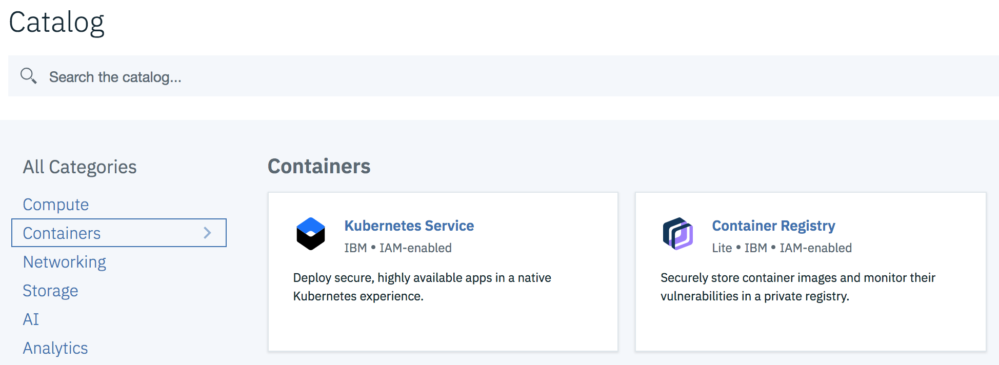
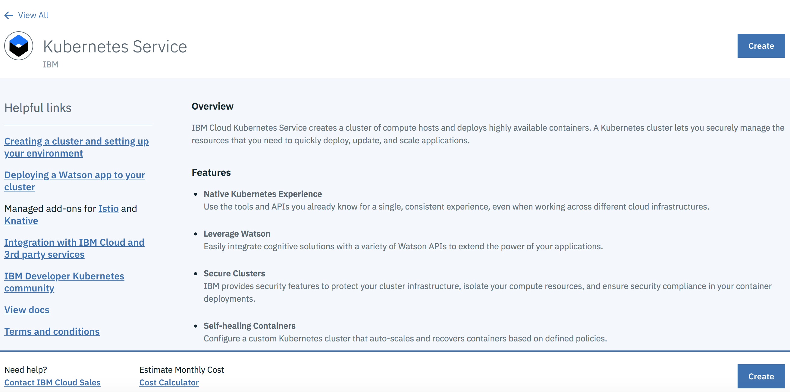
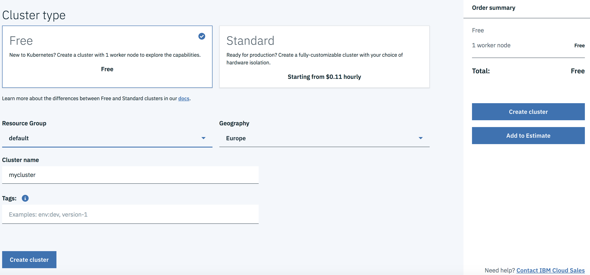
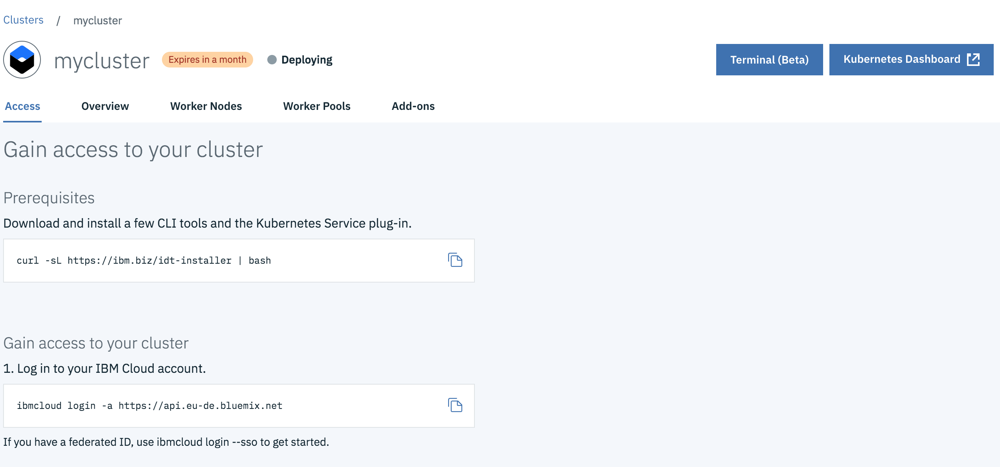

## Creating clusters by IBM Cloud console

Before you can deploy an app, you must create a cluster. A cluster is a set of worker nodes that are organized into a network. The purpose of the Kubernetes cluster is to define a set of resources, nodes, networks, and storage devices that keep apps highly available.

>**NOTE** Free clusters have a life span of 30 days. After that time, the cluster expires and the cluster and its data are deleted.

Login to IBM Cloud web console `https://cloud.ibm.com/login` and open Catalog. From the Catalog, in the Containers category select `Kubernetes Service` to create a cluster.



To create this service click `Create` button.  


Select `Free` for the cluster type and preffered geography `Europe`. Keep default `mycluster` as the name for cluster. Click `Create Cluster`.


The details how to configure CLI and get acces to the cluster will be opened. Go through these steps and install CLI tools and confgiure your command line envrionment.


## Install and configure CLI envrionment

For Mac and Linux, run the following command:
````
$ curl -sL https://ibm.biz/idt-installer | bash
````
To verify that the CLI and Developer tools were installed successfully, run the help command:
````
$ ibmcloud dev help
````
The output lists the usage instructions, the current version, and the supported commands.

>**TIP** If ibmcloud have not installed, then try to install it manually: `https://cloud.ibm.com/docs/cli?topic=cloud-cli-install-ibmcloud-cli#install-ibmcloud-cli`

Log in to IBM Cloud with your IBMid. If you have multiple accounts, you are prompted to select which account to use. If you do not specify a region with the -r flag, you must also choose a region.

````
$ ibmcloud login -a https://api.eu-de.bluemix.net
````

>**TIP** If your credentials are rejected, you might be using a federated ID. To log in with a federated ID, use the --sso flag. See Logging in with a federated ID (`https://cloud.ibm.com/docs/iam/federated_id?topic=iam-federated_id#federated_id`) for more details.
````
$ ibmcloud login -a https://api.eu-de.bluemix.net --sso
````

Set the target Kubernetes Service region in which you want to work.
````
$ ibmcloud ks region-set eu-central
````

Get the command to set the environment variable and download the Kubernetes configuration files.
````
$ ibmcloud ks cluster-config mycluster
````

Set the KUBECONFIG environment variable. Copy the output from the previous command and paste it in your terminal. The command output should look similar to the following.

````
$ export KUBECONFIG=/Users/$USER/.bluemix/plugins/container-service/clusters/mycluster/kube-config-mil01-mycluster.yml
````

Verify that you can connect to your cluster by listing your worker nodes.
````
$ kubectl get nodes
NAME             STATUS    AGE       VERSION
10.144.188.160   Ready     2m        v1.12.6+IKS
````

## Set up a private registry

Set up your own private image repository in IBM Cloud Container Registry to securely store and share Docker images with all cluster users. A private image repository in IBM Cloud is identified by a **namespace**. The **namespace** is used to create a unique URL to your image repository that developers can use to access private Docker images.

We choose `microprofile` as our namespace to group all images:
````
$ ibmcloud cr namespace-add microprofile
Adding namespace 'microprofile'...

Successfully added namespace 'microprofile'

OK
````

Check that you can login and push images into the new private registry under your namespace:
````
$ ibmcloud cr login
Logging in to 'registry.eu-de.bluemix.net'...
Logged in to 'registry.eu-de.bluemix.net'.

OK
````
To test pushing images, do the following steps:

- get the `hello-world` image from DockerHub
````
$ docker pull hello-world
````
- tag the `hello-world` image with a name containing your private registry name:
````
$ docker tag hello-world registry.eu-de.bluemix.net/microprofile/hello-world:latest
````
- push `hello-world` image into the private registry
````
$ docker push registry.eu-de.bluemix.net/microprofile/hello-world:latest
````
- list images from the private registry
````
$ ibmcloud cr image-list
Listing images...

REPOSITORY                           TAG      DIGEST         NAMESPACE      CREATED        SIZE    SECURITY STATUS   
de.icr.io/microprofile/hello-world   latest   92c7f9c92844   microprofile   3 months ago   977 B   No Issues   

OK
````


